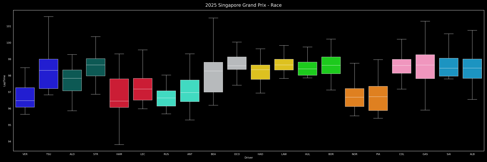
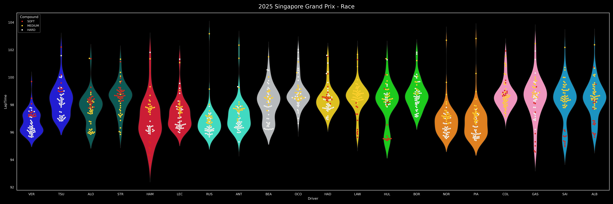
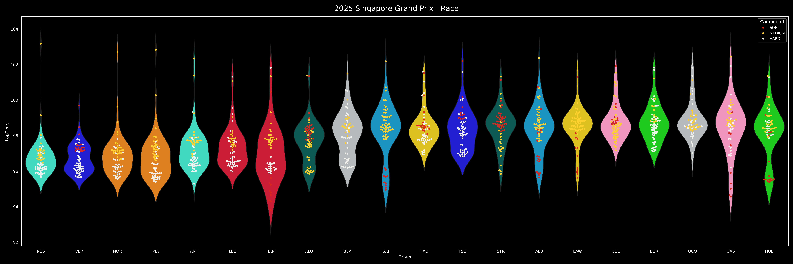

# Armchair Strategist

This repository contains all the code for the armchair strategist [dashboard](www.armchair-strategist.dev) as well as engineered data for F1 races from the 2018 season onwards.

The dashboard and visualizations in this README are updated every Monday at midnight to reflect the latest race.

## Visualizations of the Most Recent Race

    

        <b>Pit Stop Strategies</b>
    

    
    

        

            <b>Function call:</b>
        

        <code>strategy_barplot(season, event)</code>
    

    

        <b>Position Changes</b>
    

    
    

        

            <b>Function call:</b>
        

        <code>driver_stats_scatterplot(season, event, drivers=10)</code>
    

    

        <b>Point Finishers Race Pace</b>
    

    
    

        

            <b>Function call:</b>
        

        <code>strategy_barplot(season, event)</code>
    

    

        <b>Podium Finishers Gap to Winner</b>
    

    
    

        

            <b>Function call:</b>
        

        <code>driver_stats_lineplot(season, event, drivers=3)</code>
    

    

        <b>Teammate Pace Comparisons</b>
    

    Boxplot visualization:
    
    

        

            <b>Function call:</b>
        

        <code>driver_stats_distplot(season, event, violin=False, swarm=False, teammate_comp=True, drivers=20)</code>
    

    Violinplot with all laptimes:
    
    

        

            <b>Function call:</b>
        

        <code>driver_stats_distplot(season, event, violin=False, swarm=False, teammate_comp=True, drivers=20)</code>
    

    

        <b>Driver Pace Comparison</b>
    

    
    

        

            <b>Function call:</b>
        

        <code>driver_stats_distplot(season, event, violin=True, swarm=True, teammate_comp=False, drivers=20)</code>
    

    

        <b>Team Pace Ranking</b>
    

    
    

        

            <b>Function call:</b>
        

        See <code>f1_visualization/readme_machine.py</code>
    

## Build
Build with `pip install -e .` Using a Python virtual environment is highly recommended.

## [Dashboard](www.armchair-strategist.dev)
Run dashboard locally with `python3 app.py`. Debug mode can be enabled by setting `app.run(debug=True)` in `app.py`.

## Contributing
You should install pre-commit hooks with `pre-commit install`.

## Data Source

All data sourced from the [FastF1](https://github.com/theOehrly/Fast-F1) package.

## Data Availability

Data from all grand prixs and sprint races beginning in the 2018 season, excluding test sessions, are available. This repository will be automatically updated during the F1 season.

## Metrics Definitions

See `SCHEMA.md` for details on the columns provided in `Data/all_laps_*.csv` and `Data/transformed_laps_*.csv` files.

## Additional Examples

    

        <b>Tyre Degradation Lineplot</b>
    

    
    

        

            <b>Function call:</b>
        

        <code>compounds_lineplot(seasons, events)</code>
    

    

        <b>Tyre Degradation Distribution Plot</b>
    

    
    

        

            <b>Function call:</b>
        

        <code>compounds_distplot(seasons, events)</code>
    

