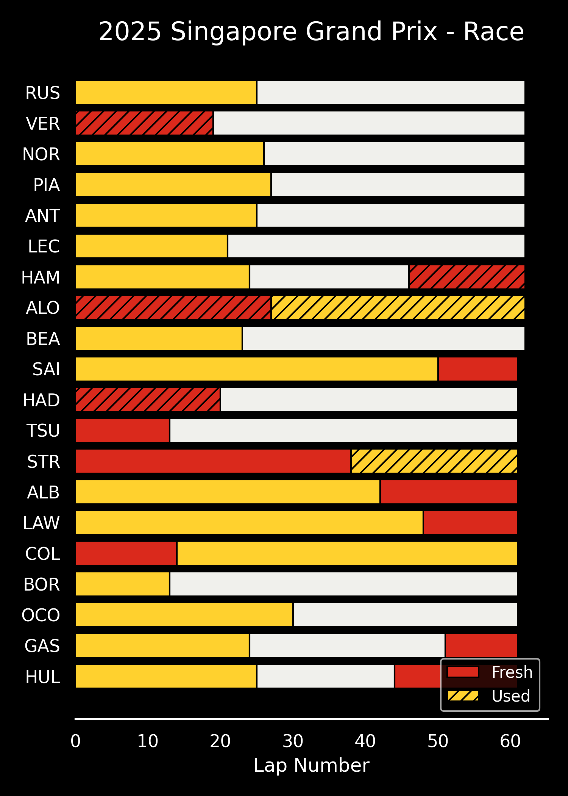
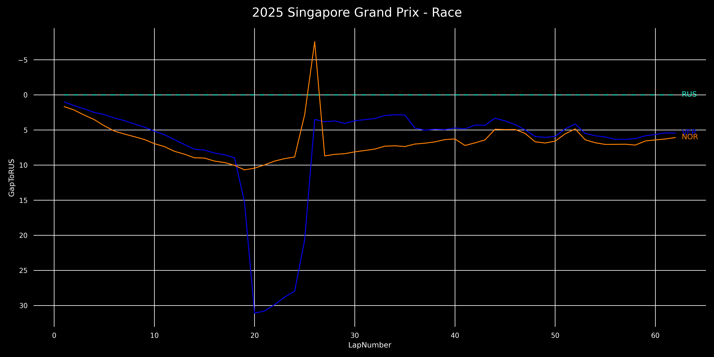

# F1-Data-Visualization

Engineered F1 data from the 2018 season onwards and visualization tools. Visualizations automatically updated to reflect the latest race on the Monday after the race at midnight EDT.

## Visualizations of the Most Recent Race

<b>Pit Stop Strategies</b>

<b>Position Changes</b>

<b>Point Finishers Race Pace</b>

<b>Podium Finishers Gap to Winner</b>

<b>Teammate Pace Comparisons</b>

Violinplot with all laptimes:

<b>Team Pace Comparisons</b>

## Requirements

Use `python3 -m pip install -r requirements.txt` to install all dependencies.

## Data Source

All data sourced from the [FastF1](https://github.com/theOehrly/Fast-F1) package.

## Data Availability

Data from all races beginning in the 2018 season, excluding test sessions, are available. This repository will be regularly updated during the F1 season.

## Metrics Definitions

See `SCHEMA.md` for details on the columns provided in `Data/all_laps_*.csv` and `Data/transformed_laps_*.csv` files.

## Important Files

- Use `src/main.py` or `Notebooks/visualization.ipynb` to make your own visualizations. `Notebooks/visualization.ipynb` contains some example visualizations towards the end of the file.
- `Notebooks/data_loading.ipynb` and `Notebooks/data_transformation.ipynb` are _planned for removal_. Prefer `src/preprocessing.py` for acquiring and processing data.
