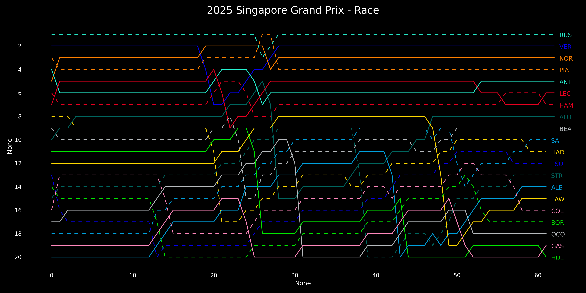
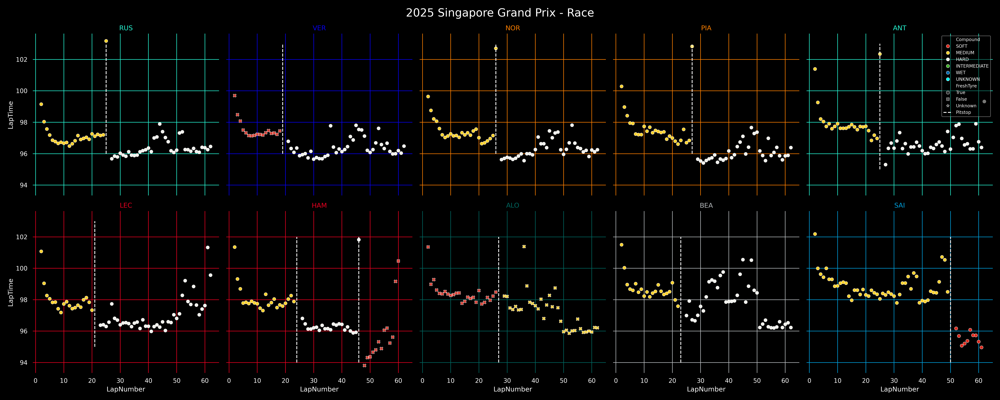
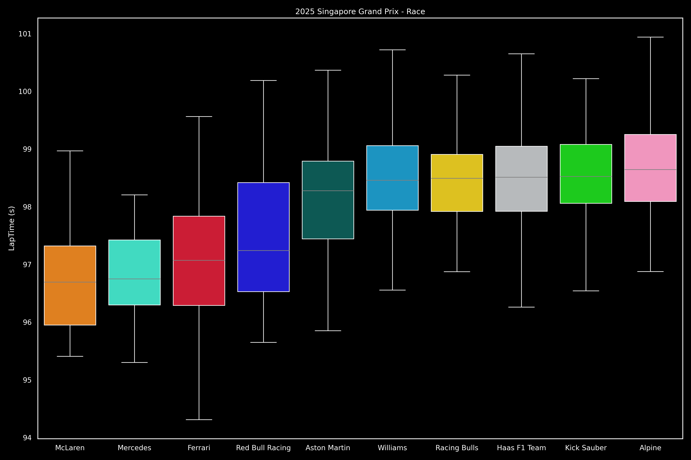

# F1-Data-Visualization

This repository contains engineered F1 data for all grand prixs and sprint races from the 2018 season onwards and some handy visualization tools. Visualizations in the README are automatically updated to reflect the latest race on the Monday after the race at midnight EDT.

## Visualizations of the Most Recent Race/Examples

    

        <b>Pit Stop Strategies</b>
    

    
    

        

            <b>Function call:</b>
        

        <code>strategy_barplot(season, event)</code>
    

    

        <b>Position Changes</b>
    

    
    

        

            <b>Function call:</b>
        

        <code>driver_stats_scatterplot(season, event, drivers=10)</code>
    

    

        <b>Point Finishers Race Pace</b>
    

    
    

        

            <b>Function call:</b>
        

        <code>strategy_barplot(season, event)</code>
    

    

        <b>Podium Finishers Gap to Winner</b>
    

    
    

        

            <b>Function call:</b>
        

        See <code>src/readme_machine.py</code>
    

    

        <b>Teammate Pace Comparisons</b>
    

    Boxplot visualization:
    
    

        

            <b>Function call:</b>
        

        <code>driver_stats_distplot(season, event, violin=False, swarm=False, teammate_comp=True, drivers=20)</code>
    

    Violinplot with all laptimes:
    
    

        

            <b>Function call:</b>
        

        <code>driver_stats_distplot(season, event, violin=False, swarm=False, teammate_comp=True, drivers=20)</code>
    

    

        <b>Team Pace Comparisons</b>
    

    
    

        

            <b>Function call:</b>
        

        See <code>src/readme_machine.py</code>
    

## Requirements

Use `python3 -m pip install -r requirements.txt` to install all dependencies.

## Data Source

All data sourced from the [FastF1](https://github.com/theOehrly/Fast-F1) package.

## Data Availability

Data from all races beginning in the 2018 season, excluding test sessions, are available. This repository will be automatically updated during the F1 season.

## Metrics Definitions

See `SCHEMA.md` for details on the columns provided in `Data/all_laps_*.csv` and `Data/transformed_laps_*.csv` files.

## Usage Guide

- Use `src/adhoc_visuals.py` to make your own visualizations.

## Additional Examples

    

        <b>Tyre Degradation Lineplot</b>
    

    
    

        

            <b>Function call:</b>
        

        <code>compounds_lineplot(seasons, events)</code>
    

    

        <b>Tyre Degradation Distribution Plot</b>
    

    
    

        

            <b>Function call:</b>
        

        <code>compounds_distplot(seasons, events)</code>
    

